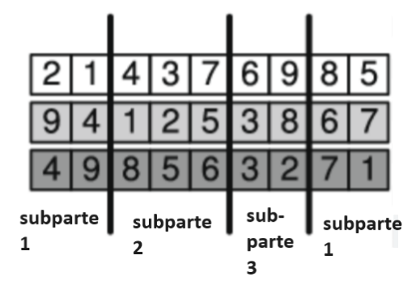
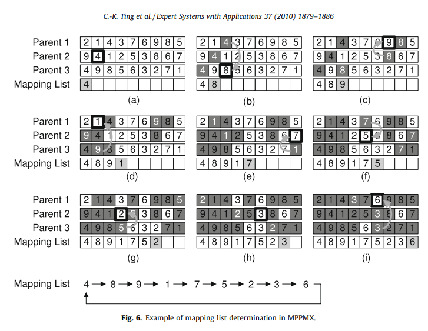

# CI5652 - Identical Machine Scheduling
Proyecto de Diseño de Algoritmos II (CI5652) con soluciones aproximadas para el problema de Identical Machine Scheduling. Trimestre Abr-Jul 2024. Universidad Simón Bolívar.

## 📝 Integrantes
- Ana Shek (19-10096)
- Santiago Finamore (18-10125)
- Jeamhowards Montiel (19-10234)

# 🤔 Descripción del problema
Dado un conjunto de `n` tareas y `m` máquinas idénticas, el objetivo es asignar cada tarea a una máquina y determinar la secuencia de tareas en cada máquina de manera que se minimice la tardanza total (the total tardiness). Cada tarea `j` tiene un tiempo de procesamiento `p_j` y una fecha de vencimiento `d_j`. La tardanza de una tarea se calcula como `max(0, C_j - d_j)`, donde `C_j` es el tiempo de finalización del trabajo `j`.

# 📋 INFORME DEL PROYECTO - TERCER CORTE
El programa está implementado en C++ y consta de los siguientes archivos para este tercer corte:

- `memetic.cpp`: Archivo principal del programa que contiene la implementación de una solución utilizando el algoritmo memético para el problema.
- `aco.cpp`: Archivo principal del programa que contiene la implementación de una solución utilizando el algoritmo de optimicación de colonia de hormigas para el problema.

📂 En la carpeta `benchmarks` se encuentran los casos de pruebas de la primera corte del proyecto para medir y comparar el rendimiento de diferentes algoritmos para solucionar el problema descrito.

## Definición del operador de cruce utilizado en el algoritmo genético para una recombinación de al menos 3 padres, el método de mejora luego de la recombinación y la implementación del algoritmo memético

### 😂 Algoritmo Memético ( ͡° ͜ʖ ͡°)

### 👨‍👩‍👦👨‍👩‍👦👨‍👩‍👦 Operador de cruce utilizado en el algoritmo genético para una recombinación de al menos 3 padres

- **Operador de cruce utilizado en el algoritmo genético**: Cruce parcialmente mapeado.

- **Cruce parcialmente mapeado para múltiples padres**: Se implementa el cruce parcialmente mapeado para múltiples padres, cuyo proceso consiste en:

    1. Sea `k` el número de padres. 

    2. Se seleccionan aleatoriamente `k` puntos de corte para dividir cada padre en `k + 1` subpartes.

    

    3. Se crea una lista de mapeo (`ch_map`) utilizando la función `create_mapping_list`. Esta lista mapea los genes (o tareas) de diferentes padres entre sí. 

        3.1. Sea `g` el número de genes o tareas de un individuo.

        3.2. Se crea un arreglo `job_mapped` para rastrear qué tareas ya han sido mapeados y un contador de tareas mapeados `cnt_mapped`

        3.3. Se selecciona aleatoriamente un padre `start_parent` y un gen inicial del padre seleccionado `start_gene`.

        3.4. Luego se ejecuta un bucle con `g` iteraciones
        
            3.4.1. En el bucle, se marca el gen actual `start_gene` como mapeado.

            3.4.2. Se selecciona un padre final `end_parent` aleatoriamente y diferente del padre inicial y se busca en el padre final el gen que corresponde a la misma tarea que el gen inicial, al encontrarlo se guarda el gen en `end_gene`.

            3.4.3. Se incrementa `cnt_mapped` a 1. Si todos las tareas han sido mapeados, se sale del bucle.

            3.4.4. Si aún faltan tareas por mapear, se elige un nuevo padre inicial diferente del final y se selecciona un nuevo gen inicial cuya tarea no haya sido mapeada aún.

            3.4.5. Y se agrega un mapeo con `ch_map[end_gene.job->id] = start_gene`

        3.5. Después del bucle, se agrega un mapeo final de la tarea del último gen a la tarea del gen inicial (el primer gen que se mapea). Esto para crear un mapeo cíclico entre tareas.

        

    4. Luego, se crea un orden aleatorio en los genes para cada subparte con la función `create_random_order` y este orden aleatorio se guarda en un arreglo `order`

    5. Se crean los `k` hijos.

    6. Primero cada hijo `i` se copia la primera subparte del padre `i` (antes del primer punto de corte y después del último punto de corte).

    7. Luego, para cada hijo `i`, las subpartes entre los puntos de corte se copian de otros padres en un patrón diagonal.

    8. Posteriormente, se legaliza cada hijo para asegurar que no hayan trabajos duplicados.

        8.1. Se crea un nuevo orden aleatorio `new_order` para procesar las subpartes del hijo `i`.

        8.2. Se marcan inicialmente la primera subparte procesada, o sea, la primera subparte de cada hijo permanece igual.

        8.3. Para cada subparte restante según el orden en `new_order`.

            8.3.1. Se revisa cada gen de la subparte actual según el orden en `order`.

            8.3.2. Si la tarea ya está marcado (duplicado), se reemplaza con el trabajo mapeado según la lista de mapeo (`ch_map`). Este proceso continúa hasta encontrar un trabajo no marcado.
            
            8.3.3. Al encontrar un trabajo no marcado, se marca el nuevo trabajo y se actualiza el gen en el hijo actual.

        8.4. Se verifica que todas las tareas estén marcadas (para asegurar que no hayan tareas duplicadas y tampoco tareas faltantes).

    9. Se devuelven los hijos generados.

### 🚀⬆ Mejora luego de la recombinación

Para este paso, se utiliza la búsqueda local implementada en la primera corte del proyecto.

1. Sea un hijo `h` producido en la recombinación.

2. Se decodifica el genotipo del hijo `h` en un fenotipo válido.

3. Luego, se le aplica la búsqueda local al fenotipo convertido.

4. Y por último, el resultado de la búsqueda local se transforma nuevamente en un genotipo.

### 🛠️ Parámetros del algoritmo memético

Aparte de recibir las tareas y la cantidad de máquinas, y los parámetros del algoritmo genético: 
- population_size: El tamaño de la población

- mutation_rate: El porcentaje de mutación.

- max_iter: El máximo número de iteraciones o generaciones.

El algoritmo memético recibe adicionalmente los siguientes parámetros:
- nro_parents_crossover: Un entero para la cantidad de padres para ser seleccionadas para la recombinación en cada generación.

- opt_freq: Un entero que indica la frequencia de aplicar la mejora con la búsqueda local. Responde a la pregunta de ¿cada cuántas generaciones se lanza la optimización?

- opt_rate: Un float para el porcentaje de aplicar la mejora en la búsqueda local sobre los descendientes. ¿Cuántos invididuos generados son optimizados en cada generación?

- random_opt_rate: Un valor booleano que indica si aplicar la búsqueda local con un porcentaje aleatorio en  cada generación o aplicarlo según el opt_rate. Y si es aleatorio, el valor del parámetro es true, en caso contrario es false. Además, si es aleatorio, el valor de porcentaje para la búsqueda local en cada generación debe ser mayor que 10%, esto para asegurar que siempre se aplique una cantidad significativa de optimización local.

### 👣 Proceso del algoritmo memético

Los primeros pasos del algoritmo memético son similares al algoritmo genético de la segunda corte del proyecto:

1. Se genera una población aleatoria inicial.

2. Se ordena la población por su fitness.

3. Luego, se comienza un bucle. Hasta que se terminen el máximo número de generaciones o se encuentre la solución óptima (un fitness igual a 0), se procede a: 

    3.1. Calcular el fitness de cada individuo y la suma del fitness total de la población.

    3.2. Crear una nueva población, el cual se generan nuevos individuos hasta llenar el 90% de la nueva población. El 10% restante se completa con los mejores individuos de la población anterior.

Acá el paso 3.2. cambia un poco para el algoritmo memético:

3.2.1. Se seleccionan múltiples padres usando la función `choose_multi_parents`. La selección de padres es la misma condición para el algoritmo genético.
> Si definimos f(i) como la aptitud del individuo i de la población S, entonces la probabilidad p(i) de que i sea escogido como padre viene dada por: p(i) = 1 - f(i)/sum(f(j) for j in S) 

3.2.2. Se aplica el cruce parcialmente mapeado multi-parental.

Luego del paso 3.2, se continua dentro del bucle con los siguientes pasos:

3.3. Se aplica mutación a los nuevos individuos generados 
> Mutación: Reasigna el trabajo seleccionado dentro de una máquina a otra máquina aleatoriamente escogida.

3.4. Se optimiza la generación si es que le toca optimizarse (`opt_freq`):
- Se determina cuántos individuos optimizar (basado en `random_opt_rate` y `opt_rate`).
- Se aplica búsqueda local a los individuos seleccionados.

3.5. La nueva población reemplaza a la anterior.

3.6. Se ordena la nueva población por su aptitud o fitness.

3.7. Se repite desde el paso 3.1 a 3.6 hasta que se finalice el bucle.

## Definición del comportamiento de la feromona/heurística e implemente con ello una optimización de colonia de hormigas
### 🐜 Optimización de Colonia de Hormigas

#### Feromona 

- **Estructura**: Se implementa como una matriz bidimensional donde cada elemento τ[i][j] representa el nivel de feromona para asignar la tarea i a la máquina j.

- **Inicialización**: Al comenzar, todos los valores de feromona se establecen en 1.0, indicando que inicialmente no hay preferencia por ninguna asignación.

- **Actualización local**: Después de cada asignación de tarea, se actualiza la feromona usando la fórmula:
  τ[job][machine] = (1 - ρ_local) * τ[job][machine] + ρ_local * Δτ
  Donde Δτ es 1 dividido por el retraso máximo calculado inicialmente y ρ_local es un parámetro que controla la tasa de evaporación local.

- **Actualización global**: Al final de cada iteración, se actualiza la feromona basándose en la mejor solución encontrada:
  τ[i][j] = (1 - ρ_global) * τ[i][j] + ρ_global * (1 / mejor_retraso) 
    Donde ρ_global es un parámetro que controla la tasa de evaporación global y mejor_retraso es el retraso total de la mejor solución encontrada.

- **Uso**: En la selección de tareas, la feromona se eleva a la potencia α para ajustar su influencia en la decisión.

#### Heurística


- **Cálculo**: Se define como el inverso del retraso modificado de la fecha de vencimiento (modified due date tardiness o MDD):
  η = 1 / MDD(tiempo_actual_máquina, tarea)

- **Función MDD**: Calcula el retraso potencial de una tarea si se asignara a una máquina en un momento dado. 

- **Uso**: En la selección de tareas, la heurística se eleva a la potencia β para ajustar su influencia en la decisión.

- **Equilibrio con la feromona**: La probabilidad de seleccionar una tarea para una máquina se calcula como:
  P[i][j] ∝ (τ[i][j])^α * (η[i][j])^β
  Donde τ es la feromona, η es la heurística, y α y β son parámetros que controlan la importancia relativa de la feromona y la heurística respectivamente.

Esta combinación de feromona y heurística permite al algoritmo equilibrar entre explotar la información aprendida (a través de la feromona) y responder a las características específicas de cada tarea y el estado actual de las máquinas (a través de la heurística). Esto guía al algoritmo hacia soluciones que minimizan el retraso total de las tareas, adaptándose dinámicamente a medida que construye y mejora las soluciones.

#### Pasos del Algoritmo

1. **Inicialización**

El algoritmo comienza creando la matriz de feromonas. Además, se calcula el MDD Tardiness que se usa como referencia para la actualización local de la feromona. 

2. **Ciclo principal**

El corazón del algoritmo es un ciclo que se repite un número fijo de veces. Cada repetición de este ciclo representa una generación completa de soluciones. Durante cada iteración, el algoritmo generará una solución, la mejorará, y usará la información obtenida para influir en las siguientes generaciones.

3. **Construcción de soluciones**

En esta fase, el algoritmo crea múltiples soluciones desde cero. Cada solución se construye de manera similar a cómo una hormiga construiría un camino. Se comienza con todas las tareas sin asignar y todas las máquinas vacías. Luego, para cada tarea, se selecciona primero una máquina, favoreciendo aquellas con menos tiempo de procesamiento acumulado. Después, se elige una tarea para esa máquina, basándose en los niveles de feromona (que indican qué tan buena ha sido esta asignación en el pasado) y la urgencia de la tarea. Una vez hecha la asignación, se actualiza el tiempo de procesamiento de la máquina y se modifica ligeramente el nivel de feromona para esa combinación específica de tarea y máquina.

4. **Actualización local de feromonas**

Después de asignar cada tarea a una máquina, el algoritmo actualiza los niveles de feromona localmente. Esto se hace aumentando los niveles de feromona para las combinaciones de tarea-máquina que se han asignado en esta solución.

5. **Mejora local**

Una vez construida una solución completa, el algoritmo intenta mejorarla. Esto se hace mediante un proceso de búsqueda local.

6. **Evaluación**

Después de mejorar cada solución, el algoritmo calcula su calidad midiendo el retraso total que produce. Si esta solución resulta ser mejor que la mejor encontrada hasta ahora (es decir, si produce un retraso total menor), se guarda como la nueva mejor solución. 

7. **Actualización global de feromonas**

Al final de cada iteración, después de haber construido y evaluado todas las soluciones de esa generación, el algoritmo actualiza la matriz de feromonas basándose en la mejor solución encontrada. Esto se hace aumentando los niveles de feromona para las combinaciones de tarea-máquina que aparecen en la mejor solución.

8. **Evaporación de feromonas**

Para evitar que el algoritmo se quede atrapado en soluciones subóptimas, se implementa un mecanismo de evaporación de feromonas. Esto significa que en cada iteración, todos los niveles de feromona se reducen ligeramente.

9. **Finalización**

Después de completar todas las iteraciones programadas, el algoritmo termina y devuelve la mejor solución que ha encontrado. Esta solución representa la programación de tareas que, según el algoritmo, debería producir el menor retraso total posible dado el conjunto de tareas y máquinas disponibles.

## 🚀 Uso

Para compilar y ejecutar el programa, se debe ejecutar los siguientes comandos en la terminal:

```bash
make
```

```bash
cd target
```

```bash
./PROY3 <path_to_benchmarks> <algorithm>
```

Donde `<path_to_benchmarks>` es la ruta a la carpeta que contiene los casos de prueba y `<algorithm>` es el número del algoritmo a ejecutar:

1. Algoritmo Memético
2. Búsqueda Dispersa
3. Optimización de Colonia de Hormigas

## 📄 Analisis de resultados

A continuación se presenta el análisis de los resultados obtenidos al ejecutar el programa con los casos de prueba en la carpeta `benchmarks` en una **laptop** con **procesador AMD Ryzen 5 5500U**, **disco SSD**, **8GB de memoria RAM** y **WSL 2 Ubuntu**. Se tomará en cuenta los valores de tardanza óptima obtenidos del paper de referencia de donde se obtuvo el `benchmark` para comparar los resultados obtenidos con los algoritmos implementados de ambos cortes del proyecto.


### 📊 Métricas Comparativas
Las métricas claves en el análisis incluyen:

- **Tardanza Total (Total Tardiness)**: La suma de las tardanzas de todas las tareas.
- **Diferencia con la Solución Óptima (Optimal Solution Difference)**: La diferencia entre la solución obtenida y la solución óptima.
- **Tiempo en segundos (Time in seconds)**: El tiempo en segundos tomado por el algoritmo.

Así mismo, se emplearon diferentes parámetros para cada algoritmo implementado en este segundo corte:
**Parámetros del Iterated Local Search (ILS)**:
 * max_iter Cantidad máxima de iteraciones para el algoritmo ILS
 * p0 La fuerza de perturbación inicial.
 * pmax El multiplicador máximo de fuerza de perturbación.
 * lsmax El número máximo de iteraciones para el algoritmo de local search dentro de ILS.
 * itermax El número máximo de iteraciones antes de aumentar la fuerza de la perturbación.

> ILS1: max_iter = 1500, p0 = 10, pmax = 4, lsmax = 100, itermax = 100

> ILS2: max_iter = 1000, p0 = 3, pmax = 15, lsmax = 70, itermax = 150

**Parámetros del Tabu Search (TS)**:
 * max_iter El número máximo de iteraciones para el algoritmo de búsqueda tabú.
 * max_grn_iter El número máximo de iteraciones para generar vecinos dentro de cada iteración.
 * tabu_tenure El tamaño de la lista tabú.

> TS1: max_iter = 10000, max_grn_iter = 100, tabu_ternure = 7

> TS2: max_iter = 6000, max_grn_iter = 70, tabu_ternure = 5

**Parámetros del Simulated Annealing (SA) o Reconocido Simulado**:
 * t0 La temperatura inicial para el algoritmo de recocido simulado.
 * t_step El factor por el cual la temperatura disminuye en cada iteración.
 * max_iter_t_step El número máximo de iteraciones en cada paso de temperatura.
 * max_iters El número máximo de iteraciones para el algoritmo de recocido simulado.

> SA1: t0 = 2000, t_step = 0,90, max_iter_t_step = 100, max_iter = 1500

> SA2: t0 = 1500, t_step = 0,70, max_iter_t_step = 120, max_iter = 1500

> SA3: t0 = 1500, t_step = 0,85, max_iter_t_step = 100, max_iter = 1000

**Parámetros del GRASP**:
 * max_iters El número máximo de iteraciones a realizar.
 * alpha El valor alfa utilizado para calcular la condición para RCL.

> Grasp 0.25-30: max_iters = 30, alpha = 0.25

> Grasp 0.5-30: max_iters = 30, alpha = 0.5

> Grasp 0.75-30: max_iters = 30, alpha = 0.75

> Grasp 0.25-60: max_iters = 60, alpha = 0.25

> Grasp 0.5-60: max_iters = 60, alpha = 0.5

> Grasp 0.75-60: max_iters = 60, alpha = 0.75

> Grasp 0.25-100: max_iters = 100, alpha = 0.25

> Grasp 0.5-100: max_iters = 100, alpha = 0.5

> Grasp 0.75-100: max_iters = 100, alpha = 0.75


**Parámetros del Genetic Algorithm (GA) o Algoritmo Genético**:
 * population_size El tamaño de la población para el algoritmo genético.
 * mutation_rate el porcentaje en que ocurren las mutaciones durante el algoritmo genético.
 * max_iter El número máximo de iteraciones para el algoritmo genético.

> GA1: population_size = 50, mutation_rate = 5%, max_iter = 4000

> GA2: population_size = 50, mutation_rate = 10%, max_iter = 4000

> GA3: population_size = 100, mutation_rate = 5%, max_iter = 8000

### 📈 Resultados
Los resultados obtenidos al ejecutar el programa con los casos de prueba en la carpeta `benchmarks` se encuentran en el directorio `results`, sin embargo, debido a la cantidad de datos obtenidos, se almacenó los datos más relevantes en el siguiente enlace: [Resultados](https://docs.google.com/spreadsheets/d/1hKiU8t9stOFJTKyNNQ1MKPmBr3OwZpMlk57sYdZWiEQ/edit#gid=294798782)

A modo de resumen y para facilitar la visualización de los resultados, se presentan las siguentes imágenes comparativas resumidas a continuación:

#### Promedio de diferencia entre la solución obtenida y la solución óptima cada n tareas y m máquinas
- Resultados del corte anterior:
    - Solución heurística
    
    - Solución de búsqueda local partiendo de una solución heurística
    
    - Solución de búsqueda local partiendo de una solución aleatoria.


- Resultados de Iterated Local Search (ILS), Tabu Search (TS) y Simulated Annealing (SA) usando diferentes parámetros:


- Resultados de GRASP usando diferentes parámetros:


- Resultados de Genetic Algorithm (GA) usando diferentes parámetros:


#### Resultados ordenados por promedio de diferencias entre la solución obtenida y la solución óptima por n = 20


#### Resultados ordenados por promedio de diferencias entre la solución obtenida y la solución óptima por n = 25


#### Promedio de tiempo en segundos para cada n tareas y m máquinas
- Resultados del corte anterior:
    - Solución heurística
    
    - Solución de búsqueda local partiendo de una solución heurística
    
    - Solución de búsqueda local partiendo de una solución aleatoria.


- Resultados de Iterated Local Search (ILS), Tabu Search (TS) y Simulated Annealing (SA) usando diferentes parámetros:


- Resultados de GRASP usando diferentes parámetros:


- Resultados de Genetic Algorithm (GA) usando diferentes parámetros:


#### Resultados ordenados por promedio de tiempo por n = 20


#### Resultados ordenados por promedio de tiempo por n = 25


## 📌 Conclusiones

- **Según el promedio de diferencias entre la solución óptima y la solución obtenida**:
    - **Para n = 20** (segun la lista de resultados ordenados por promedio de diferencias entre la solución obtenida y la solución óptima por n = 20):
        - *El algoritmo que dió menor diferencia entre las soluciones óptimas y las soluciones obtenidas* es **GRASP con alpha = 0.25** para el RCL **y con un máximo de 100 iteraciones**, cuyo promedio de diferencia es de 1,2071.
        - *El algoritmo que dió mayor diferencia entre las soluciones óptimas y las soluciones obtenidas* es el **Algoritmo Genético con *population_size = 50, mutation_rate = 10%, max_iter = 4000** con un promedio de diferencia mayor que 150, específicamente, 154,81156.
        - Además, en el caso del algoritmo genético, vemos que *GA1* y *GA2*, que tienen un promedio de diferencia mayor a 150, están debajos de la búsqueda local con solución inicial aleatoria que tiene un promedio de diferencia de 117,2631. Así mismo, para este caso n=20, *GA1*, que se diferencia de *GA2* por tener un porcentaje de mutación de 5% menos que *GA2*, vemos que *GA1* es mejor en cuánto a la diferencia con las soluciones óptimas que *GA2*. Y del uso de los diferentes parámetros para el algoritmo genético, vemos que *GA3* (con mayor cantidad de iteraciones y mayor tamaño de población con el mismo porcentaje de mutación que *GA1*) es mejor que *GA1* y *GA2* e incluso de las soluciones obtenidas con la búsqueda local partiendo de la solución inicial aleatoria.
        - Luego, **todos los que están encima de *GA3* tienen un promedio de diferencia menor de 20**, siendo *la solución heurística* el que está encima de *GA3*.
        - Justamente encima de la solución heurística, se encuentra el algoritmo de *Reconocido Simulado* usando los 3 diferentes parámetros, vemos que *SA2* tiene menor diferencia con la solución óptima en comparación con *SA1* y *SA3*, lo que sugiere que aunque *SA2* tiene una temperatura inicial y el t_step (factor el cual la temperatura disminuye en cada iteración) menor o igual que las otras dos, lo importante es que tiene un max_iter_t_step mayor (el número max de iteraciones en cada paso de temperatura).
        - Para el ILS, se observa que ambos ILSs están justos encima de *SA2*, siendo el mejor entre las dos, el *ILS2*, que aunque tiene menor cantidad de iteraciones máximas para el algoritmo ILS y también la menor cantidad de iteraciones para el algoritmo local search que trabaja dentro del ILS, se tiene que produce mejores resultados si el ILS tiene un mayor multiplicador máximo de fuerza de perturbación, así como también un mayor número de iteraciones antes de aumentar la fuerza de perturbación junto con una menor fuerza de perturbación inicial. 
        - *Arriba del *ILS2**, se encuentra *la búsqueda local a partir de una solución inicial heurística*, con una diferencia con el *ILS2* de 0,89.
        - Las dos búsquedas locales, ***TS1* y *TS2* se presentan encima de la solución con *búsqueda local partiendo de una solución inicial heurística***, el cual *TS2* tiene menos diferencia con las soluciones óptimas que *TS1*. De esto, se sugiere que a pesar de que *TS2* tiene valores menores para la cantidad máxima de iteraciones, el número máximo de iteraciones para generar vecinos dentro de cada iteración (max_gnr_iter) y el número de iteraciones durante las cuales un movimiento permanece en la lista tabú (tabu_tenure), una configuración más pequeña en estos parámetros puede conducir a un mejor rendimiento del algoritmo de búsqueda tabú.
        - Y por último, las 9 diferentes configuraciones del **algoritmo GRASP** están encima de cualquier otro algoritmo. Y según los resultados, parece que **para un alpha pequeño, como 0.25, ofrece mejores soluciones al problema para cualquier cantidad de iteraciones**.

    - **Para n = 25** (segun la lista de resultados ordenados por promedio de diferencias entre la solución obtenida y la solución óptima por n = 20):
        - Para este caso, vemos que **el que ofrece mejores soluciones al problema sigue siendo *el algoritmo GRASP con alpha = 0.25 y un máximo de 100 iteraciones***. 
        - Así mismo, el orden desde *GRASP 0.25-100* hasta *ILS1* permanece igual que para el caso de n = 20.
        - Los últimos tres de la lista son justamente las tres configuraciones diferentes del algoritmo genético, el cual tiene un promedio de diferencias mayores que 170, donde *GA3* sigue siendo mejor que *GA1* y *GA2*. Estas últimas dos tienen un promedio de diferencias mayores que 230. 
        - Sin embargo, ahora *GA3* está debajo de la solución de búsqueda local con solución inicial aleatoria. Además, *GA2* está encima de *GA1*, lo cual parece sugerir que para una cantidad de tareas (n) mayor, es preferible tener un porcentaje de mutación más grande.
        - **La solución heurística sigue siendo mejor que los algoritmos genéticos y la búsqueda local con solución inicial aleatoria**.
        - Para el caso de las 3 configuraciones del algoritmo simulado reconocido (SA), las tres siguen estando encima de la solución heurística, pero ahora se tiene que *SA2* está debajo tanto de *SA1* como de *SA3*. De estas 3 configuraciones de SA, el mejor es *SA1*, el cual tiene valores mayores para la temperatura inicial, el factor de decremento de la temperatura y el número máximo de iteraciones para el algoritmo.

- **Según el tiempo promedio de ejecución**
    - **Para n=20:**
        - El algoritmo más rápido es la heurística, con un tiempo de 0.00037 segundos, lo que lo hace extremadamente eficiente en términos de tiempo. *El algoritmo GRASP* presenta un buen balance entre *tiempo de ejecución* y *calidad de solución*. Por ejemplo, *Grasp 0.25-30* tiene un tiempo de ejecución de 0.61 segundos, siendo uno de los más rápidos dentro de los GRASP, mientras que *Grasp 0.75-100* es *el más lento dentro de esta categoría* con un tiempo de *2.32 segundos*. Esto sugiere que, aunque incrementar el número de iteraciones puede mejorar ligeramente la calidad de la solución, *también aumenta el tiempo de ejecución de manera considerable*.

        - Las ejecuciones del *algoritmo de búsqueda tabú (TS1 y TS2)* tienen *tiempos de ejecución moderados*, con *TS1* tomando *7.60 segundos* y *TS2 2.82 segundos*. *TS2* es notablemente más rápido y también produce soluciones de mejor calidad, lo que indica que *una configuración de parámetros más ajustada* puede *mejorar tanto la eficiencia* como *la efectividad del algoritmo* de búsqueda tabú.

        - *El algoritmo de recocido simulado (SA1, SA2, SA3)* muestra tiempos más altos, especialmente *SA1 y SA2*, que *tienen tiempos de 3.31 y 3.97 segundos* respectivamente.

        - La búsqueda local con solución inicial heurística y aleatoria tienen tiempos similares, de 1.35 y 1.38 segundos respectivamente*. Sin embargo, la búsqueda local con solución inicial heurística produce soluciones de mejor calidad, lo que sugiere que *el tiempo adicional invertido en una buena solución inicial es beneficioso.*

        - *La búsqueda local iterativa (ILS1 y ILS2)* *muestra tiempos de 2.41 y 1.07 segundos* respectivamente, con *ILS2 siendo más rápido*. Esto indica que configuraciones con menos iteraciones pueden ser más eficientes sin sacrificar mucho en términos de calidad de solución.

        - *El algoritmo genético es el más lento*, con *GA3 siendo el más lento con un tiempo de 141.46 segundos*. *Las otras configuraciones del algoritmo genético (GA1 y GA2) también son lentas*, con *tiempos de 17.25 y 16.39 segundos respectivamente*, lo que los hace ineficientes para problemas donde el tiempo de ejecución es crítico.

    - **Para n=25:**
        - *La heurística sigue siendo el algoritmo más rápido con un tiempo de 0.00033 segundos.* *El algoritmo GRASP mantiene tiempos de ejecución bajos*, con *Grasp 0.25-30* siendo el más rápido con *0.31 segundos* y *Grasp 0.75-100 el más lento con 1.24 segundos*. Esto confirma que las configuraciones de GRASP con menos iteraciones son más rápidas y aún efectivas, haciendo de GRASP una opción robusta para diferentes tamaños de problema.

        - *El algoritmo de búsqueda tabú (TS1 y TS2)* tiene *tiempos de ejecución de 6.87 y 2.71 segundos respectivamente*. *La reducción en el tiempo de ejecución de TS2 en comparación con TS1 sigue siendo significativa*, reforzando la idea de que una configuración optimizada del algoritmo de búsqueda tabú puede ofrecer grandes mejoras en eficiencia.

        - *El algoritmo de recocido simulado (SA1, SA2, SA3) muestra tiempos moderados, con SA1 y SA2 en 3.33 y 3.96 segundos respectivamente*, mientras que *SA3* con 1,87 segundos, siendo la más rápida que las otras dos configuraciones de reconocido simulado.

        - *La búsqueda local con solución inicial heurística y aleatoria tienen tiempos de 1.22 segundos cada uno*, manteniendo consistencia en su eficiencia. La búsqueda local con solución inicial heurística sigue siendo la mejor opción por su balance entre tiempo y calidad de la solución.

        - *Las configuraciones de búsqueda local iterativa (ILS1 y ILS2) muestran tiempos de 2.28 y 0.91 segundos respectivamente*, con *ILS2 siendo nuevamente más rápido*. Esto sugiere que ILS2 no solo es más eficiente en términos de tiempo, sino que también mantiene una buena calidad de solución.

        - *El algoritmo genéticos sigue siendo el más lento*, con *GA3* *siendo el más lento con un tiempo de 137.34 segundos*. *GA1 y GA2 también presentan tiempos altos, con 16.70 y 20.28 segundos respectivamente.* Este alto costo computacional, junto con la menor calidad de solución en comparación con otros algoritmos, hace que el algoritmo genético con estas configuraciones sean menos atractivos para este tipo problemas de tamaño n=25.
    
    **En resumen, GRASP con alpha = 0.25 y 100 iteraciones ofreció la mejor combinación de precisión y tiempo de ejecución, mientras que los algoritmos genéticos fueron los menos eficientes en ambas métricas.**
