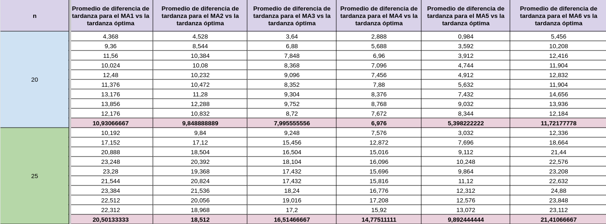
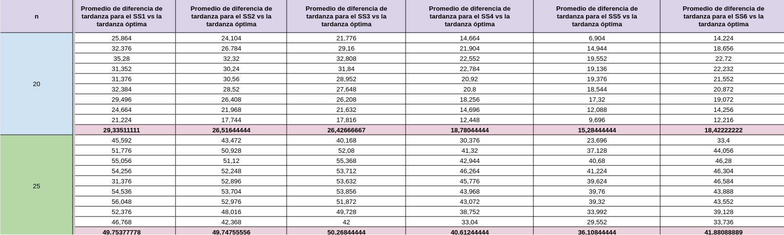
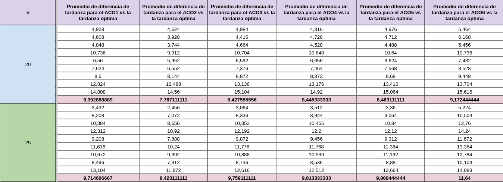
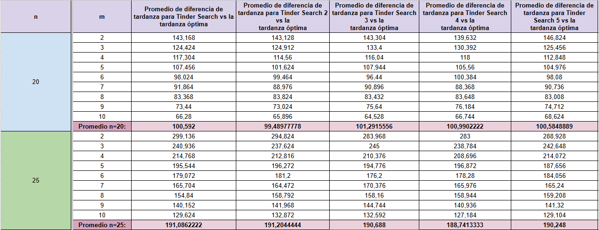
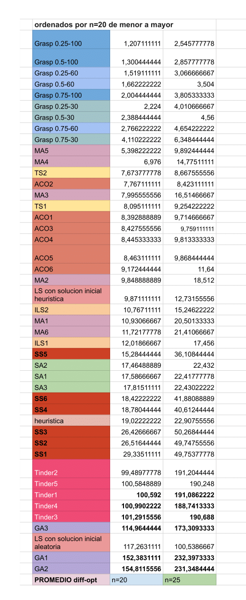
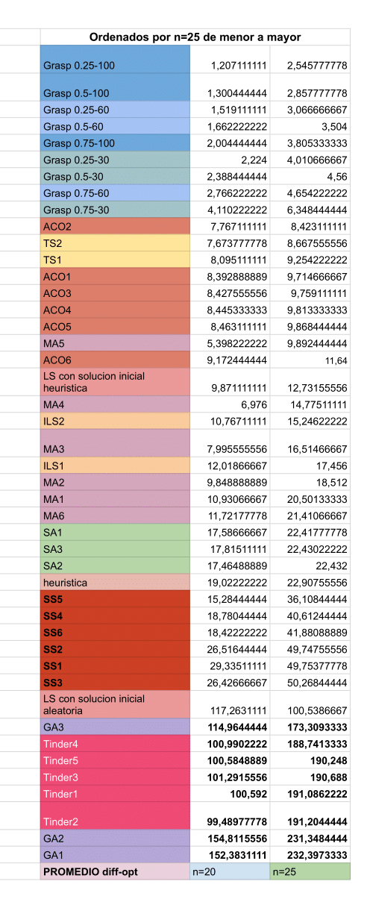
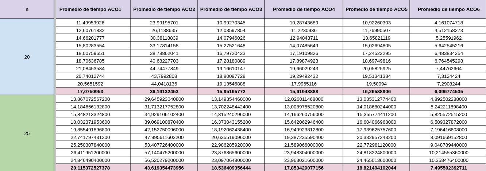
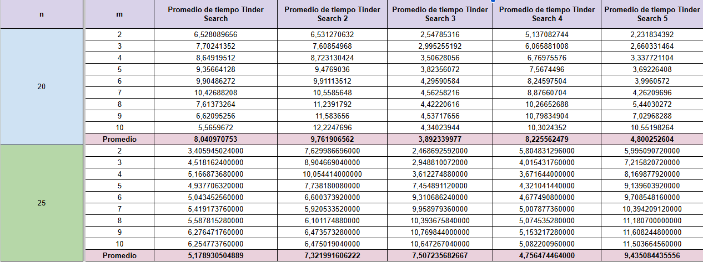
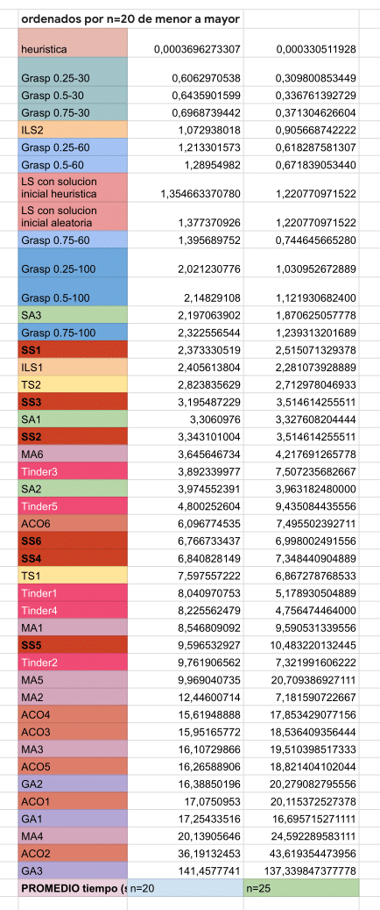
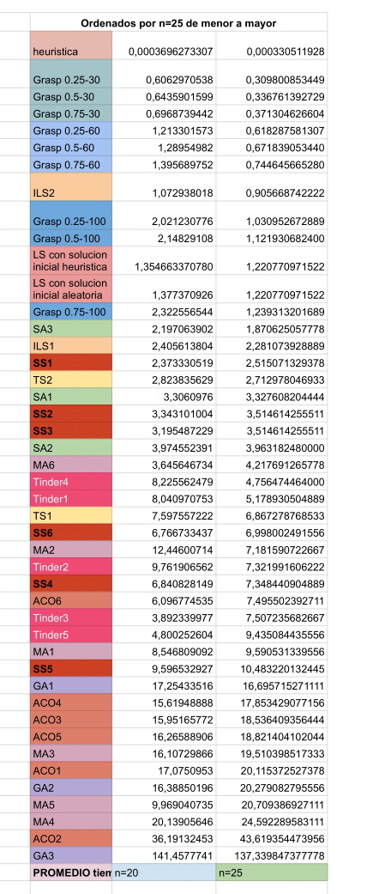

# CI5652 - Identical Machine Scheduling
Proyecto de Diseño de Algoritmos II (CI5652) con soluciones aproximadas para el problema de Identical Machine Scheduling. Trimestre Abr-Jul 2024. Universidad Simón Bolívar.

## 📝 Integrantes
- Ana Shek (19-10096)
- Santiago Finamore (18-10125)
- Jeamhowards Montiel (19-10234)

# 🤔 Descripción del problema
Dado un conjunto de `n` tareas y `m` máquinas idénticas, el objetivo es asignar cada tarea a una máquina y determinar la secuencia de tareas en cada máquina de manera que se minimice la tardanza total (the total tardiness). Cada tarea `j` tiene un tiempo de procesamiento `p_j` y una fecha de vencimiento `d_j`. La tardanza de una tarea se calcula como `max(0, C_j - d_j)`, donde `C_j` es el tiempo de finalización del trabajo `j`.

# 📋 INFORME DE METAHEURÍSTICA TINDER SEARCH - CUARTO CORTE DE PROYECTO

## Definición de conceptos y explicación de la metaheurística

### Trasfondo e Inspiración

La metaheurística desarrollada consta de un algoritmo poblacional inspirado en las dinámicas modernas de la humanidad alrededor de la búsqueda de pareja.

Fundamentalmente, las relaciones interpersonales en las sociedades humanas distan en su funcionamiento de los principios Darwinistas que inspiran los algoritmos genéticos tradicionales. Esto en el sentido de que los humanos no suelen hacer escogencia de una pareja en función de sus aptitudes físicas o sus probabilidades de supervivencia, sino guiados por un análisis subjetivo orientado por nuestros gustos y preferencias inherentes. De esta manera, las probabilidades de un individuo de perpetuar su descendencia no viene estrictamente dado por la calidad de sus genes con respecto al entorno, sino por su capacidad de encontrar potenciales parejas con preferencias mututamente compatibles.

En la actualidad, las aplicaciones de citas y piezas de software similares se han posicionado commo una de las alternativas más populares para buscar pareja. Entre estas, la más popular es Tinder, que fue lanzada al mercado en septiembre de 2012 y se posiciona actualmente como la líder de su mercado con una cuota del 27.6% ([Fuente](https://usesignhouse.com/blog/tinder-stats/)). La aplicación trabaja bajo un modelo de feed, donde los usuarios son proveídos con perfiles de otras personas dentro de la aplicación. El usuario puede entonces filtrar posibles candidatos explorando los perfiles que le son facilitados por el algoritmo e indicando gusto (deslizando a la derecha) o disgusto (deslizando a la izquierda) en base a la información presente en el perfil.

Si dos usuarios indican gusto mutuo, adquieren la capacidad de entrar a un entorno de chat privado donde pueden profundizar su interacción y coordinar actividades y encuentros para avanzar en una posible relación. Hoy día, este paradigma se ha establecido y ha permeado en la sociedad como una de las principales alternativas para las personas que están buscando pareja (En las generaciones más jóvenes podría argumentarse que es *la* principal). El objetivo de este informe es explorar cómo se desempeña en el contexto de generación de soluciones de calidad para problemas de optimización combinatoria.

### Tinder Search: Funcionamiento y Parámetros

Siendo un algoritmo poblacional, la metaheurística opera bajo una estructura medular bastante similar a otros vistos a lo largo del curso: El algoritmo trabaja sobre un espacio de soluciones de tamaño definido, denominado "población", dentro del cual distintas soluciones, denominadas "individuos" son alteradas y combinadas entre sí con el objetivo de ir generando nuevas potenciales soluciones de mayor calidad. Las variaciones introducidas por Tinder Search con respecto a los demás algoritmos poblacionales explorados radican en el proceso de selección de soluciones padre y en el funcionamiento general del proceso de cruce entre individuos.

#### Individuos y preferencias

Adicional a su genotipo, en Tinder Search cada individuo contará con 2 atributos adicionales que funcionan como parte de sus características:

* Un conjunto G que denominaremos *"gustos del individuo"*. 
* Un conjunto D que denominaremos *"disgustos del individuo".*

En conjunto, el par ordenado (G, D) constituye lo que denomamos las *"preferencias del individuo"*, y en efecto representan las características que cada individuo busca en potenciales parejas. La definición específica de los conjuntos queda intencionalmente vaga y dependerá del problema a resolver y de las decisiones individuales del implementador, sin embargo, a continuación proveemos algunos ejemplos de posibles implmementaciones para algunos problemas específicos:

* En el problema de la mochila, G y D podrían definirse como conjuntos de objetos que el individuo quiere y no quiere que posibles parejas incluyan en su solución respectivamente.
* En el problema del agente viajero, podrímamos definir las preferencias de un individuo por pares ordenados (X, Y), representando que el individuo prefiere o rechaza que en las permutaciones de otros individuos la ciudad Y esté después de la ciudad X
* En el problema MAX-SAT, se podrían definir como palabras de bits indicando los valores preferidos para cada variable.

Para la implementación específica realizada para *Parallel Machine Scheduling*, las preferencias de un individuo vienen dadas por una matriz P de dimensión `MxJ`, donde la posición `P[i][j]` contiene:

* 1 si al individuo le gusta que el trabajo `j` esté en la máquina `i`.
* -1 si al individuo no le gusta que el trabajo `j` esté en la máquina `i`.
* 0 si el individuo tiene preferencia neutral por que el trabajo `j` esté en la máquina `i`.

Cabe destacar que los conjuntos G y D no tienen que necesariamente cubrir todas las características posibles. Si una característica particular no se encuentra representada por las preferencias de un individuo, se asume que esta tiene influencia neutral sobre la toma de decisiones del mismo y que no afecta su potencial atracción hacia otras soluciones.

#### Selección de padres y proceso de cruce

Al igual que en otros algoritmos poblacionales, la selección de padres dentro de la población se realiza de manera probabilística. Sin embargo, la probabilidad de ser elegido como padre no viene guiada por las aptitudes de los individuos, sino por el nivel en que su genotipo se asemeje a las preferencias de otros sujetos en la población.

Al momento de seleccionar una pareja para cruce, un primer individuo (individuo explorador) es seleccionado de la población de manera aleatoria. Una vez fijado este, otras soluciones son escogidas al azar y presentadas al individuo previamente elegido (individuo candidato). Esto puede verse como análogo a un usuario en Tinder explorando los perfiles dispoibles en su feed. Para cada uno, las preferencias del primer individuo son utilizadas para determinar el nivel de atracción que siente por el individuo que le fue presentado. El nivel de atracción viene dado por algún valor real entre 0 y 1, donde 0 representa rechazo total, y 1 representa atracción total  (Nuevamente, la forma específica de calcular la atracción se deja intencionalmente vaga y queda a discresión del implementador específico). 

Una vez calculado el nivel de atracción, este se usa para determinar probabilísticamente si el individuo que está explorando aceptará o no al individuo presentado. En caso de que lo acepte (swipe right), el proceso tendrá que repetirse en la dirección inversa, pues dos individuos solo hacen match si se gustan mutuamente. Si alguno de los individuos no acepta al otro (swipe left), se siguen explorando soluciones hasta encontrar un match mutuo.

Una vez dos individuos se aprueban mutuamente, se pasa a lo que denominamos el *proceso de chatteo*. Para el mismo, inicialmente se calcula el nivel de compatibilidad entre los dos individuos como el producto de sus atracciones. Posteriormente se inicia un proceso iterativo donde valores aleatorios entre 0 y 1 son escogidos y comparados contra el valor de compatibilidad. Si el valor escogido es menor que la compatibilidad entre los individuos, se considera que el mensaje fue exitoso y se sigue con el proceso; en caso contrario, la conversación se toma como infructuosa y el individuo que estaba explorando perfiles tendrá que buscar nuevamente algún otro candidato. Agregado a esto, en cualquier punto de la conversación se tiene una probabilidad del 50% de que el individuo explorador sea *ghosteado* por el individuo candidato. En caso de ser ghosteado, el proceso de conversación fracasa automáticamente y, además, el individuo explorador pasa a tener disgusto por una o varias de las características del individuo candidato. El número de mensajes exitosos que deben darse para pasar al proceso de cruce es pasado como argumento al algoritmo.

Para evitar la situación donde un individuo se estanca intentando culminar un proceso de chatteo con éxito, durante el proceso de selección se cuenta con un valor modificador conocido como *nivel de desesperación*. Este es un valor real no negativo que se suma a la compatibilidad para aumentar las probabilidades de que el chatteo sea exitoso. El nivel de desesperación inicia en cero y va aumentando por un valor *delta* a medida que el individuo explorador falla en conseguir pareja. El valor *delta* es pasado como parámetro al algoritmo.

Si dos individuos logran hacer match y llevar el proceso de chatteo a completitud proceden a cruzarse y generar descendencia. De la misma manera en que las soluciones hijo obtenían sus genes mediante alguna combinación de los genes de sus padres, las preferencias de las nuevas soluciones vendrán dadas como alguna combinación de las preferencias de los individuos que las engendraron. El operador de cruce no tiene características definidas para esta meta-heurística y queda a discresión del implmentador.

Este proceso se repite hasta que se genere en su completitud la próxima generación de soluciones. Como mecanismo de itensificación, se establece que si la población tiene N miembros, entonces la próxima generación estará conformada por los N individuos más aptos de la unión entre los padres y las nuevas soluciones generadas. Al igual que en otros algoritmos poblacionales, se siguen creando nuevas generaciones de individuos hasta que se cumpla algún criterio de parada, y ante el cumplimiento de este se retorna la mejor solución encontrada.

#### Parámetros entonables

Ahora explicado el algoritmo, se procede a enumerar y describir los parámetros entonables que son pasados como argumentos a la meta-heurística

* `population_size`: Tamaño de la población de soluciones.
* `mutation_rate`: Probabilidad de mutación para los individuos.
* `max_iter`: Número máximo de iteraciones del ciclo principal a realizar.
* `no_profile`: Número de perfiles que serán explorados por cada individuo en su feed.
* `delta`: Valor diferencial por el cual se incrementará el nivel de desesperación durante el proceso de exploración de perfiles.
* `to_ghost`: Flag booleano indicando si los individuos tendrán permitido ghostear.
* `nro_msgs`: Número de mensajes que deben ser exitosamente intercambiados entre dos individuos para proceder a cruzarse.

### 📈 Resultados
Los resultados obtenidos al ejecutar el programa con los casos de prueba en la carpeta `benchmarks` se encuentran en el directorio `results`, sin embargo, debido a la cantidad de datos obtenidos, se almacenó los datos más relevantes en el siguiente enlace: [Resultados](https://docs.google.com/spreadsheets/d/1yOY-Yu0Cx5R_WuQd0IXDCdnlSWItMLTNiqqjkom3DYk/edit?usp=sharing)

A modo de resumen y para facilitar la visualización de los resultados, se presentan las siguentes imágenes comparativas resumidas a continuación:

#### Promedio de diferencia entre la solución obtenida y la solución óptima cada n tareas y m máquinas
- Resultados del primer corte:
    - Solución heurística
    
    - Solución de búsqueda local partiendo de una solución heurística
    
    - Solución de búsqueda local partiendo de una solución aleatoria.

- Resultados del segundo corte:
    - Iterated Local Search (ILS), Tabu Search (TS) y Simulated Annealing (SA) usando diferentes parámetros:

    

    - GRASP usando diferentes parámetros:

    

    - Genetic Algorithm (GA) usando diferentes parámetros:

    

- Resultados del tercer corte: 

    - Algoritmo Memético usando diferentes parámetros:

    

    - Búsqueda Dispersa usando diferentes parámetros:

    

    - Optimización de Colonia de Hormigas usando diferentes parámetros:

    

- Resultados del cuarto corte:

    - Tinder Search usando diferentes parámetros:

    

#### Resultados ordenados por promedio de diferencias entre la solución obtenida y la solución óptima por n = 20

#### Resultados ordenados por promedio de diferencias entre la solución obtenida y la solución óptima por n = 25

#### Promedio de tiempo en segundos para cada n tareas y m máquinas
- Resultados del primer corte:
    - Solución heurística
    
    - Solución de búsqueda local partiendo de una solución heurística
    
    - Solución de búsqueda local partiendo de una solución aleatoria.

- Resultados del segundo corte:

    - Iterated Local Search (ILS), Tabu Search (TS) y Simulated Annealing (SA) usando diferentes parámetros:

    

    - GRASP usando diferentes parámetros:

    

    - Genetic Algorithm (GA) usando diferentes parámetros:

    

- Resultados del tercer corte: 

    - Algoritmo Memético usando diferentes parámetros:

    

    - Búsqueda Dispersa usando diferentes parámetros:

    

    - Optimización de Colonia de Hormigas usando diferentes parámetros:

    

- Resultados del cuarto corte:
    
    - Tinder Search usando diferentes parámetros:
    
        

#### Resultados ordenados por promedio de tiempo por n = 20

#### Resultados ordenados por promedio de tiempo por n = 25

Aquí tienes una versión más lineal del texto en formato markdown:

## 📌 Conclusiones

- **Según el promedio de diferencias entre la solución óptima y la solución obtenida**:
    - **Para n = 20** Tinder Search muestra resultados en un rango de 99.4897 a 101.2915 en términos de diferencia con la solución óptima. Estos valores son significativamente más altos que la mayoría de las otras metaheurísticas, con excepción de la búsqueda local con solución inicial aleatoria (LS) que tiene un valor de 117.2631 y las ejecuciones de los algoritmos genéticos los cuales tienen valores de 114.96 a 154.84. 

    - **Para n = 25** El rendimiento de Tinder Search en términos de precisión se deteriora , con valores que oscilan entre 188.7413 y 191.2044. Es notable que, a pesar de este empeoramiento, Tinder Search mantiene una posición relativa similar respecto a las otras metaheurísticas, superando a las ejecuciones de los algoritmos genéticos en términos de precisión.

 Tinder Search se posiciona como una opción poco atractiva en términos de precisión, solo superando a la búsqueda local con solución inicial aleatoria (LS) y a los algoritmos genéticos, pero quedando por detrás de las otras metaheurísticas evaluadas, siendo Grasp el algoritmo más preciso en ambos casos alcanzando valores de 1.20 y 2.54 para n=20 y n=25 respectivamente en términos de diferencia con la solución óptima para su mejor ejecución.

- **Según el tiempo promedio de ejecución**
    - **Para n=20:** En cuanto al tiempo de ejecución, Tinder Search muestra un comportamiento interesante. Sus tiempos varían entre 3.8923 y 9.7619 segundos, posicionándolo en un rango medio-alto en comparación con otras metaheurísticas. Algunos algoritmos como la implementación de algoritmos genéticos y Optimización de Colonia de Hormigas muestran tiempos significativamente más altos, mientras que otros como Grasp y Búsqueda Dispersa son considerablemente más rápidos. 
        
    - **Para n=25:** Los tiempos de ejecución de Tinder Search oscilan entre 4.7564 y 9.4350 segundos. Es notable que estos tiempos no aumentan drásticamente en comparación con n=20, lo que sugiere una buena escalabilidad en términos de tiempo de cómputo. 

La escalabilidad de Tinder Search presenta un panorama mixto. En términos de precisión, hay un deterioro notable al pasar de n=20 a n=25, con la diferencia respecto a la solución óptima casi duplicándose. Sin embargo, este comportamiento es común en la mayoría de las metaheurísticas analizadas.

En cuanto al tiempo de ejecución, Tinder Search muestra una escalabilidad favorable. El aumento en el tiempo de cómputo al pasar de n=20 a n=25 es relativamente modesto, especialmente en comparación con algunos otros algoritmos que experimentan incrementos más pronunciados.

Cabria destacar que, aunque la metaheurística de Tinder Search estuvo inspirada en algunos elementos de los algoritmos genéticos, su desempeño en términos de precisión y tiempo de ejecución logra superar a los algoritmos genéticos en ambos casos, lo que sugiere que la implementación de Tinder Search tiene características distintivas que la hacen una opción particularmente interesante para este problema.

Tinder Search se sitúa en una posición única entre las metaheurísticas analizadas. En términos de precisión, sus resultados son menos favorables que la mayoría de las implementaciones de metaheuristicas. Sin embargo, supera consistentemente a los algoritmos genéticos.

En cuanto al tiempo de ejecución, Tinder Search ocupa una posición intermedia. Es más rápido que las ejecuciones de las implementaciones de las metaheurísticas como Algoritmos Genéticos y algunas ejecuciones de Optimización de Colonia de Hormigas, pero más lento que Grasp, siendo este la mejor metaheuritica implementada para nuestro problema.

Por lo tanto, Tinder Search demuestra ser una metaheurística con características distintivas. Su precisión, aunque no es la mejor del grupo, se mantiene consistente al aumentar el tamaño del problema. Su tiempo de ejecución es competitivo y escala bien.