# CI5652 - Identical Machine Scheduling
Proyecto de Diseño de Algoritmos II (CI5652) con soluciones aproximadas para el problema de Identical Machine Scheduling. Trimestre Abr-Jul 2024. Universidad Simón Bolívar.

## 📝 Integrantes
- Ana Shek (19-10096)
- Santiago Finamore (18-10125)
- Jeamhowards Montiel (19-10234)

# 🤔 Descripción del problema
Dado un conjunto de `n` tareas y `m` máquinas idénticas, el objetivo es asignar cada tarea a una máquina y determinar la secuencia de tareas en cada máquina de manera que se minimice la tardanza total (the total tardiness). Cada tarea `j` tiene un tiempo de procesamiento `p_j` y una fecha de vencimiento `d_j`. La tardanza de una tarea se calcula como `max(0, C_j - d_j)`, donde `C_j` es el tiempo de finalización del trabajo `j`.

# 📋 INFORME DEL PROYECTO - SEGUNDO CORTE
El programa está implementado en C++ y consta de los siguientes archivos para este segundo corte:

- `grasp.cpp`: Archivo principal del programa que contiene la implementación de una solución utilizando GRASP para el problema.
- `evolution.cpp`: Archivo que contiene los tipos de datos y algoritmos requeridos por la implementación del algoritmo genético para la reoslución del problema.

📂 En la carpeta `benchmarks` se encuentran los casos de pruebas de la primera corte del proyecto para medir y comparar el rendimiento de diferentes algoritmos para solucionar el problema descrito.

## Definición de una perturbación e implementación de una búsqueda local iterada (ILS).

### 🔄 ILS

La implementación del algoritmo de Búsqueda Local Iterada (ILS) recibe la información de las `n` tareas, la cantidad de `m` máquinas, y varios parámetros que controlan el proceso de búsqueda, como el número máximo de iteraciones y la fuerza de perturbación inicial. A continuación se describen los pasos de la implementación:

1. **Inicialización:** 
    - El algoritmo empieza creando una solución inicial `S` utilizando el método `mddScheduling`. 
    - Luego, aplica el algoritmo `local search` a esta solución inicial para obtener una solución mejorada `S`.
    - Esta solución `S` es considerada la mejor solución conocida hasta el momento (`best_schedule`).

2. **Iteraciones principales:** 
    - Para cada iteración, se realiza una perturbación a la solución actual `current_schedule` aplicando un número `p` de movimientos aleatorios.
    - Después de la perturbación, se aplica el algoritmo `local search` para mejorar la solución perturbada.

3. **Evaluación de soluciones:** 
    - Si la solución mejorada tiene una tardanza total (`total_tardiness`) menor que la mejor solución conocida, se actualiza la mejor solución y se restablece la fuerza de perturbación `p` a su valor inicial.
    - Si no mejora, se incrementa un contador `i`.

4. **Ajuste de la perturbación:** 
    - Si el contador `i` alcanza el límite `itermax`, se incrementa la fuerza de perturbación `p`. Si `p` excede un valor máximo `pmax`, se restablece a su valor inicial.

5. **Repetición:** 
    - Se repiten los pasos 2-4 hasta que se agoten las iteraciones.

El algoritmo `ILS` busca explorar el espacio de soluciones mediante la combinación de perturbaciones y optimización local, ayudando a escapar de óptimos locales y encontrar soluciones mejores.

## Definición de reglas para movimientos que han de ser tabús e implementación de una búsqueda tabú.

### 🚫 Tabu Search

La implementación del algoritmo de Búsqueda Tabú recibe la información de las `n` tareas, la cantidad de `m` máquinas, y varios parámetros que controlan el proceso de búsqueda, como el número máximo de iteraciones y la tenencia de la lista tabú. A continuación se describen los pasos de la implementación:

1. **Inicialización:** 
    - El algoritmo empieza creando una solución inicial `S` utilizando el método `mddScheduling`. 
    - Esta solución `S` es considerada la mejor solución conocida hasta el momento (`best_schedule`).

2. **Lista Tabú:** 
    - Se inicializa una lista tabú para almacenar los movimientos que están prohibidos temporalmente.

3. **Iteraciones principales:** 
    - Para cada iteración, se identifica la máquina con mayor tardanza (`tardiest_machine`).
    - Se generan múltiples vecinos de la solución actual mediante movimientos aleatorios en la máquina con mayor tardanza.
    - Se selecciona el mejor vecino que no esté en la lista tabú o que mejora la mejor solución conocida.

4. **Actualización de la lista Tabú:** 
    - Si el mejor vecino no está en la lista tabú o mejora la mejor solución conocida, se actualiza la solución actual y se añade uno de los índices de los trabajos restantes de la maquina con más tardiness a la lista tabú, esto para asegurar que no se extraigan varias veces elementos de la misma maquina, evitando así ciclos.
    - Si la lista tabú excede su tamaño máximo (`tabu_tenure`), se elimina el movimiento más antiguo.

5. **Actualización de la mejor solución:** 
    - Si el vecino seleccionado mejora la mejor solución conocida, se actualiza la mejor solución.

6. **Repetición:** 
    - Se repiten los pasos 3-5 hasta que se agoten las iteraciones.

El algoritmo `Tabu Search` busca explorar el espacio de soluciones evitando ciclos y escapando de óptimos locales mediante el uso de una lista tabú que prohíbe ciertos movimientos temporalmente.

## Definición de un proceso de enfriado progresivo e implementación de un recocido simulado.

### ❄️ Simulated Annealing

La implementación del algoritmo de Recocido Simulado (Simulated Annealing) recibe la información de las `n` tareas, la cantidad de `m` máquinas, y varios parámetros que controlan el proceso de búsqueda, como la temperatura inicial y el factor de reducción de temperatura. A continuación se describen los pasos de la implementación:

1. **Inicialización:** 
    - El algoritmo empieza creando una solución inicial `S` utilizando el método `mddScheduling`. 
    - Esta solución `S` es considerada la mejor solución conocida hasta el momento (`best_schedule`).
    - Se inicializa la temperatura `t` con un valor inicial `t0`.

2. **Iteraciones principales:** 
    - Para cada iteración, se generan múltiples vecinos de la solución actual mediante movimientos aleatorios.
    - Se calcula la diferencia de tardanza (`delta`) entre el vecino y la solución actual.

3. **Criterio de aceptación:** 
    - Si el vecino tiene una tardanza menor o igual, se acepta.
    - Si el vecino tiene una tardanza mayor, se acepta con una probabilidad `exp(-delta / t)`.

4. **Actualización de la mejor solución:** 
    - Si la solución actual mejorada tiene una tardanza menor que la mejor solución conocida, se actualiza la mejor solución.

5. **Reducción de la temperatura:** 
    - Después de un número fijo de iteraciones, se reduce la temperatura multiplicándola por un factor `t_step`.
    - Si la temperatura cae por debajo de un umbral `epsilon`, se restablece a su valor inicial `t0`.

6. **Repetición:** 
    - Se repiten los pasos 2-5 hasta que se agoten las iteraciones.

El algoritmo `Simulated Annealing` busca explorar el espacio de soluciones permitiendo peores soluciones con una probabilidad decreciente, lo que ayuda a escapar de óptimos locales y encontrar mejores soluciones globales.

## 🎲 Definición de un método de construción para una RCL e implementación de GRASP.

### 👨‍⚖️ Método de construción para una RCL

Para la definición del RCL en este problema, se utilizó el enfoque heurístico Modified Due Date (MDD) explicado en el primer corte del proyecto:

1. Sea `S` una solución parcialmente construida.
2. Se tiene una lista de tareas no programadas `U` en la solución `S`.
3. Para cada máquina `j`, dividir `U` en dos subconjuntos `U1j` y `U2j` para `j` = 1, 2, ..., `m`.
    > `U1j` contiene las tareas que no se pueden completar en su fecha de vencimiento en la máquina `j`.

    > `U2j` contiene las tareas que sí se pueden completar antes de su fecha de vencimiento en la máquina `j`.
4. De `U1j` y `U2j`, encontrar los subconjuntos `γj` y `λj` que contienen las tareas con el tiempo de procesamiento mínimo y la fecha de vencimiento mínima, respectivamente. 
5. Seleccionar una tarea `gj` de `γj` o `λj` que minimice el valor de MDD en la máquina `j`. El valor de MDD en la máquina `j` de una tarea `i` está dada por `MDD(j, i) = max(Cj + pi, di)` 
    > `Cj` es la suma del procesamiento de tiempo de las tareas que ya han sido programados en la máquina `j`.

    > `pi` es el tiempo de procesamiento de la tarea `i` con su fecha de vencimiento `di`.
6. Luego, sea `C` el conjunto resultante de tener cada par `<g, l>`, donde cada una de estos pares representa que la tarea `g` es la tarea que produce el menor valor MDD en la máquina `l`).
7. Se puede definir el costo de la función de un elemento `<g, l>` en `C` como `c(<g, l>) = MDD(g, l)`.
8. También se define `c_min = min{ c(<g, l>) | <g, l> ∈ C}` y `c_max = max{ c(<g, l>) | <g, l> ∈ C}`.
9. Entonces, el `RCL = { <g, l> ∈ C | c(<g, l>) <= c_min + α(c_max - c_min)}`

### 🎰 GRASP

La implementación del algoritmo GRASP recibe la información de las `n` tareas, la cantidad de las `m` máquinas, el `alpha` para el RCL y `el máximo número de iteraciones`. A continuación se describen los pasos de la implementación: 

1. El algoritmo empieza a generar una solución inicial aleatoria `S`. Por ahora, se tiene que `S` es la mejor solución que se tiene para el problema.
2. Ahora, para cada iteración, se construye una solución voraz aleatoria `S'`, el cual: 

    2.1. Se considera las tareas que aún no han sido programadas y se aplica el enfoque heurístico para la Lista Restringida de Candidatos (RCL). 

    2.2. De esta lista RCL, se escoge aleatoriamente un elemento: `<g, l>`. 

    2.3. Luego, del elemento seleccionado `<g, l>`, se le asigna la tarea `g` a la máquina `l`. 

    2.4. Se elimina la tarea `g` de la lista de tareas sin programar en esta solución parcial construida `S'`.

    2.5. Se repite los pasos 2.1 a 2.4 hasta que no queden tareas sin programar.
3. Se reemplaza `S` por `S'` si el retraso total o total tardiness de las tareas en la solución `S` es mayor que el de `S'`, en caso contrario, no se hace nada.
4. Se repite el paso 2 y 3 hasta que se acaben las iteraciones.

## Definición de un fenotipo/genotipo, operadores de cruce y mutación e implementación de un algoritmo genético.

### 🧬 Genotipo de los individuos para modelado del problema 

Para propósitos de nuestro problema, definimos un gen como un par ordenado que contiene el identificador numérico de un trabajo y el número de la máquina donde este trabajo está asignado en el cronograma que modela su conjunto de genes. Esto es, si tenemos, por ejemplo, la tupla (5, 8), esto representa que el trabajo de ID 5 está asignado a la máquina 8. Este modelado de un gen se encuentra en el struct `Gene` definido en `evolution.cpp`.

Como por la definición del problema cada trabajo está asignado a una sola máquina, para una instancia del mismo con `n` trabajos el genotipo de un individuo viene dado por un vector de `n` genes, donde cada posición indica la máquina a la que está asignada cada uno de los trabajos. De esta manera, el genotipo de un individuo está restringido en el hecho de que para cada trabajo en la instancia del problema su identificador aparece en el genotipo de un individuo exactamente una vez. En referencia al *orden* que tienen los trabajos dentro de cada máquina individual, el mismo viene dado por el orden que tienen los trabajos involucrados dentro del vector genotipo. Esto es, si para un individuo tenemos el vector de genes `[..., (6, 1), ..., (9, 1), ..., (4, 1), ...]` entonces en la máquina 1 estarán ubicados los trabajos de identificadores 6, 9 y 4 en ese orden.

De esta manera una población no es más que un arreglo de genotipos, que a su vez son arreglos de genes. Los tipos de datos para la representación de un individuo y de una población se encuentran en los tipos `Individual` y `Population` definidos en `evolution.cpp`.

### 👾 Fenotipo de los individuos y función de *fitness*

El fenotipo de los individuos viene dado por el mismo modelo de cronograma utilizado en el primer corte. Esto es, un cronograma es un arreglo multi-dimensional donde cada posición representa a una de las máquinas disponibles, y cada máquina es un arreglo de trabajos que indica cuáles trabajos están asignados a esa máquina y en qué orden se ejecutarán dentro de la misma. La obtensión del fenotipo de un individuo a través de su genotipo es proveída por la función `get_fenotype` definida en `evolution.cpp`.

La aptitud de un individuo viene dada directamente por la morosidad total de su fenotipo, la cual se calcula de la misma forma presentada en el corte pasado. Como los algoritmos genéticos son inherentemente problemas de maximización, y estamos ante un problema que busca un mínimo global, la definición específica de la aptitud de un individuo viene dada por el negativo de su morosidad total.

### 👨‍👩‍👦 Selección de Padres y apareamiento

El algoritmo implementado hace uso de apareamiento con 2 padres. Cada individuo tiene a su vez una probabilidad asociada de ser escogido para ser padre de la siguiente generación igual al cociente de su valor para la función de aptitud entre la suma total de las aptitudes de todos los individuos. Esto es, si definimos f(i) como la aptitud del individuo i de la población S, entonces la probabilidad p(i) de que i sea escogido como padre viene dada por:

<center> <code> p(i) = 1 - f(i)/sum(f(j) for j in S) </code> </center>

Tras ser escogidos dos padres, sus descendientes son obtenidos utilizando cruce parcialmente mapeado. Esto debido a que, como cada identificador de trabajo aparece exactamente una vez dentro del genotipo de cualquier individuo, podemos, de cierta manera, tratar los genotipos como permutaciones de los identificadores de los trabajos. 

La selección de padres y el operador de cruce vienen dados por las funciones `choose_parents` y `partially_mapped_crossover` definidas en evolution.cpp, respectivamente.

### ☢️ Mutación

La mutación de individuos se realiza con probabilidad uniforme sobre los genes de los mismos. La probabilidad de mutación es proveída como argumento de entrada al algoritmo genético (`mutation_rate`) y no varía de ninguna manera durante la ejecución del algoritmo. El operador de mutación implementado recibe un gen y reasigna el trabajo encontrado dentro del mismo a otra máquina aleatoriamente escogida. El operador de mutación no modifica de ninguna manera los identificadores de los trabajos encontrados en los genes ni efectúa ningún tipo de reordenamiento sobre los genes del fenotipo.

## 🚀 Uso

Para compilar y ejecutar el programa, se debe ejecutar los siguientes comandos en la terminal:

```bash
make
```

```bash
cd target
```

```bash
./PROY2 <path_to_benchmarks> <algorithm>
```

Donde `<path_to_benchmarks>` es la ruta a la carpeta que contiene los casos de prueba y `<algorithm>` es el número del algoritmo a ejecutar:

1. Búsqueda Local Iterada (ILS)
2. Búsqueda Tabú 
3. Reconocido Simulado
4. GRASP
5. Algoritmo Genético

## 📄 Analisis de resultados

A continuación se presenta el análisis de los resultados obtenidos al ejecutar el programa con los casos de prueba en la carpeta `benchmarks` en una **laptop** con **procesador AMD Ryzen 5 5500U**, **disco SSD**, **8GB de memoria RAM** y **WSL 2 Ubuntu**. Se tomará en cuenta los valores de tardanza óptima obtenidos del paper de referencia de donde se obtuvo el `benchmark` para comparar los resultados obtenidos con los algoritmos implementados de ambos cortes del proyecto.


### 📊 Métricas Comparativas
Las métricas claves en el análisis incluyen:

- **Tardanza Total (Total Tardiness)**: La suma de las tardanzas de todas las tareas.
- **Diferencia con la Solución Óptima (Optimal Solution Difference)**: La diferencia entre la solución obtenida y la solución óptima.
- **Tiempo en segundos (Time in seconds)**: El tiempo en segundos tomado por el algoritmo.

Así mismo, se emplearon diferentes parámetros para cada algoritmo implementado en este segundo corte:
**Parámetros del Iterated Local Search (ILS)**:
 * max_iter Cantidad máxima de iteraciones para el algoritmo ILS
 * p0 La fuerza de perturbación inicial.
 * pmax El multiplicador máximo de fuerza de perturbación.
 * lsmax El número máximo de iteraciones para el algoritmo de local search dentro de ILS.
 * itermax El número máximo de iteraciones antes de aumentar la fuerza de la perturbación.

> ILS1: max_iter = 1500, p0 = 10, pmax = 4, lsmax = 100, itermax = 100

> ILS2: max_iter = 1000, p0 = 3, pmax = 15, lsmax = 70, itermax = 150

**Parámetros del Tabu Search (TS)**:
 * max_iter El número máximo de iteraciones para el algoritmo de búsqueda tabú.
 * max_grn_iter El número máximo de iteraciones para generar vecinos dentro de cada iteración.
 * tabu_tenure El tamaño de la lista tabú.

> TS1: max_iter = 10000, max_grn_iter = 100, tabu_ternure = 7

> TS2: max_iter = 6000, max_grn_iter = 70, tabu_ternure = 5

**Parámetros del Simulated Annealing (SA) o Reconocido Simulado**:
 * t0 La temperatura inicial para el algoritmo de recocido simulado.
 * t_step El factor por el cual la temperatura disminuye en cada iteración.
 * max_iter_t_step El número máximo de iteraciones en cada paso de temperatura.
 * max_iters El número máximo de iteraciones para el algoritmo de recocido simulado.

> SA1: t0 = 2000, t_step = 0,90, max_iter_t_step = 100, max_iter = 1500

> SA2: t0 = 1500, t_step = 0,70, max_iter_t_step = 120, max_iter = 1500

> SA3: t0 = 1500, t_step = 0,85, max_iter_t_step = 100, max_iter = 1000

**Parámetros del GRASP**:
 * max_iters El número máximo de iteraciones a realizar.
 * alpha El valor alfa utilizado para calcular la condición para RCL.

> Grasp 0.25-30: max_iters = 30, alpha = 0.25

> Grasp 0.5-30: max_iters = 30, alpha = 0.5

> Grasp 0.75-30: max_iters = 30, alpha = 0.75

> Grasp 0.25-60: max_iters = 60, alpha = 0.25

> Grasp 0.5-60: max_iters = 60, alpha = 0.5

> Grasp 0.75-60: max_iters = 60, alpha = 0.75

> Grasp 0.25-100: max_iters = 100, alpha = 0.25

> Grasp 0.5-100: max_iters = 100, alpha = 0.5

> Grasp 0.75-100: max_iters = 100, alpha = 0.75


**Parámetros del Genetic Algorithm (GA) o Algoritmo Genético**:
 * population_size El tamaño de la población para el algoritmo genético.
 * mutation_rate el porcentaje en que ocurren las mutaciones durante el algoritmo genético.
 * max_iter El número máximo de iteraciones para el algoritmo genético.

> GA1: population_size = 50, mutation_rate = 5%, max_iter = 4000

> GA2: population_size = 50, mutation_rate = 10%, max_iter = 4000

> GA3: population_size = 100, mutation_rate = 5%, max_iter = 8000

### 📈 Resultados
Los resultados obtenidos al ejecutar el programa con los casos de prueba en la carpeta `benchmarks` se encuentran en el directorio `results`, sin embargo, debido a la cantidad de datos obtenidos, se almacenó los datos más relevantes en el siguiente enlace: [Resultados](https://docs.google.com/spreadsheets/d/1hKiU8t9stOFJTKyNNQ1MKPmBr3OwZpMlk57sYdZWiEQ/edit#gid=294798782)

A modo de resumen y para facilitar la visualización de los resultados, se presentan las siguentes imágenes comparativas resumidas a continuación:

#### Promedio de diferencia entre la solución obtenida y la solución óptima cada n tareas y m máquinas
- Resultados del corte anterior:
    - Solución heurística
    
    - Solución de búsqueda local partiendo de una solución heurística
    
    - Solución de búsqueda local partiendo de una solución aleatoria.

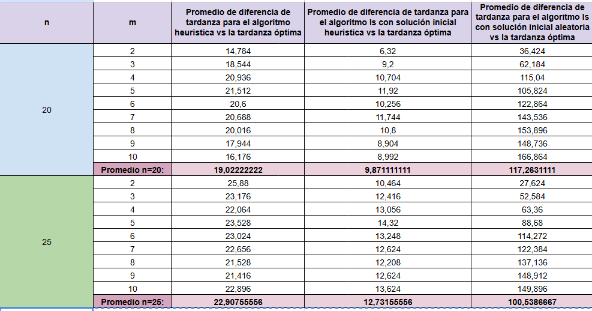

- Resultados de Iterated Local Search (ILS), Tabu Search (TS) y Simulated Annealing (SA) usando diferentes parámetros:

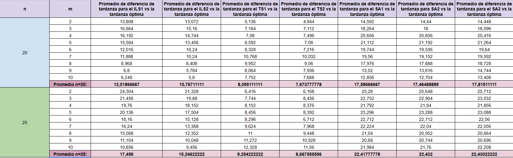

- Resultados de GRASP usando diferentes parámetros:

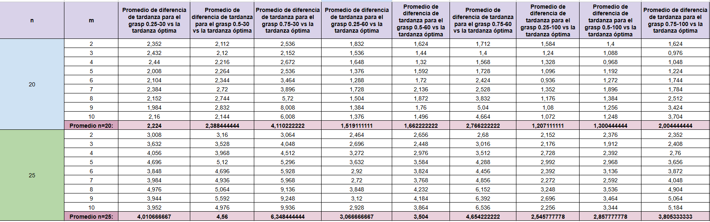

- Resultados de Genetic Algorithm (GA) usando diferentes parámetros:

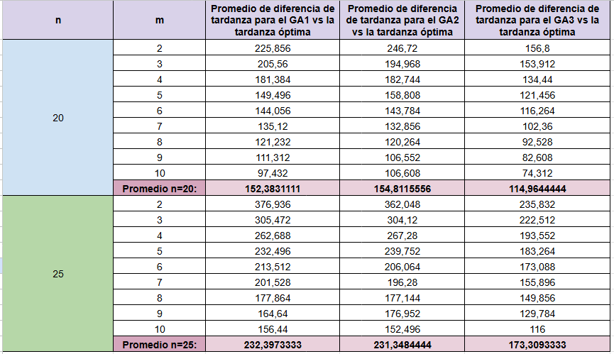

#### Resultados ordenados por promedio de diferencias entre la solución obtenida y la solución óptima por n = 20

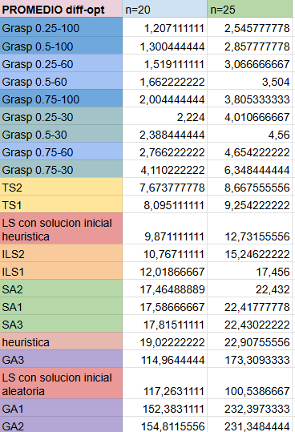

#### Resultados ordenados por promedio de diferencias entre la solución obtenida y la solución óptima por n = 25

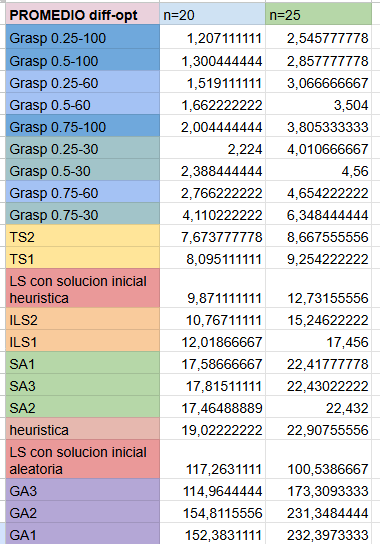

#### Promedio de tiempo en segundos para cada n tareas y m máquinas
- Resultados del corte anterior:
    - Solución heurística
    
    - Solución de búsqueda local partiendo de una solución heurística
    
    - Solución de búsqueda local partiendo de una solución aleatoria.

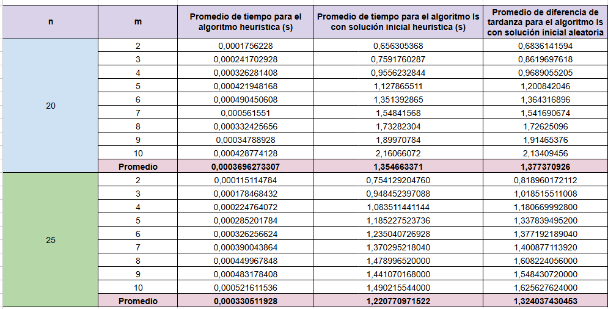

- Resultados de Iterated Local Search (ILS), Tabu Search (TS) y Simulated Annealing (SA) usando diferentes parámetros:

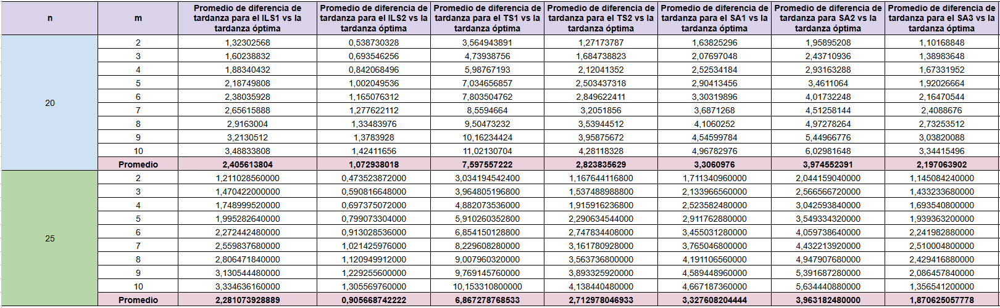

- Resultados de GRASP usando diferentes parámetros:

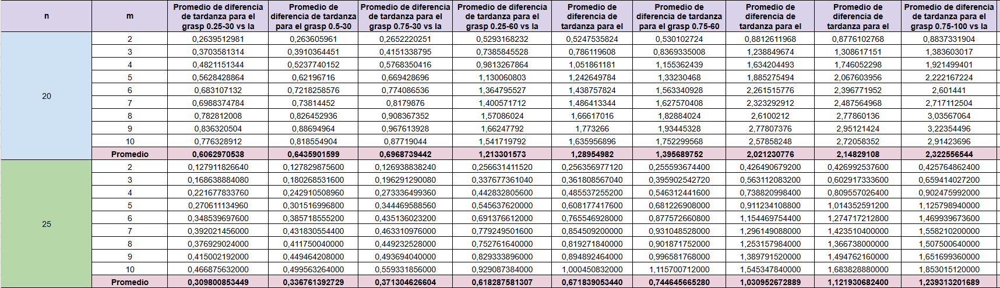

- Resultados de Genetic Algorithm (GA) usando diferentes parámetros:

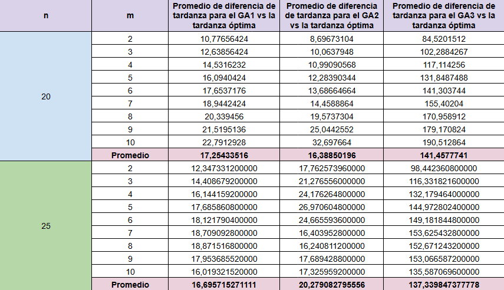

#### Resultados ordenados por promedio de tiempo por n = 20

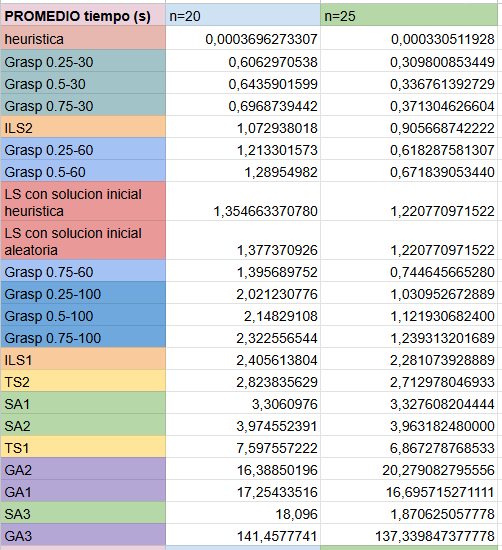

#### Resultados ordenados por promedio de tiempo por n = 25

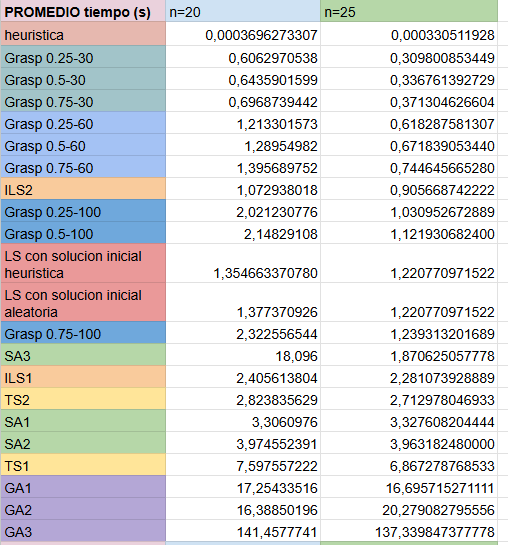


## 📌 Conclusiones

- **Según el promedio de diferencias entre la solución óptima y la solución obtenida**:
    - **Para n = 20** (segun la lista de resultados ordenados por promedio de diferencias entre la solución obtenida y la solución óptima por n = 20):
        - *El algoritmo que dió menor diferencia entre las soluciones óptimas y las soluciones obtenidas* es **GRASP con alpha = 0.25** para el RCL **y con un máximo de 100 iteraciones**, cuyo promedio de diferencia es de 1,2071.
        - *El algoritmo que dió mayor diferencia entre las soluciones óptimas y las soluciones obtenidas* es el **Algoritmo Genético con *population_size = 50, mutation_rate = 10%, max_iter = 4000** con un promedio de diferencia mayor que 150, específicamente, 154,81156.
        - Además, en el caso del algoritmo genético, vemos que *GA1* y *GA2*, que tienen un promedio de diferencia mayor a 150, están debajos de la búsqueda local con solución inicial aleatoria que tiene un promedio de diferencia de 117,2631. Así mismo, para este caso n=20, *GA1*, que se diferencia de *GA2* por tener un porcentaje de mutación de 5% menos que *GA2*, vemos que *GA1* es mejor en cuánto a la diferencia con las soluciones óptimas que *GA2*. Y del uso de los diferentes parámetros para el algoritmo genético, vemos que *GA3* (con mayor cantidad de iteraciones y mayor tamaño de población con el mismo porcentaje de mutación que *GA1*) es mejor que *GA1* y *GA2* e incluso de las soluciones obtenidas con la búsqueda local partiendo de la solución inicial aleatoria.
        - Luego, **todos los que están encima de *GA3* tienen un promedio de diferencia menor de 20**, siendo *la solución heurística* el que está encima de *GA3*.
        - Justamente encima de la solución heurística, se encuentra el algoritmo de *Reconocido Simulado* usando los 3 diferentes parámetros, vemos que *SA2* tiene menor diferencia con la solución óptima en comparación con *SA1* y *SA3*, lo que sugiere que aunque *SA2* tiene una temperatura inicial y el t_step (factor el cual la temperatura disminuye en cada iteración) menor o igual que las otras dos, lo importante es que tiene un max_iter_t_step mayor (el número max de iteraciones en cada paso de temperatura).
        - Para el ILS, se observa que ambos ILSs están justos encima de *SA2*, siendo el mejor entre las dos, el *ILS2*, que aunque tiene menor cantidad de iteraciones máximas para el algoritmo ILS y también la menor cantidad de iteraciones para el algoritmo local search que trabaja dentro del ILS, se tiene que produce mejores resultados si el ILS tiene un mayor multiplicador máximo de fuerza de perturbación, así como también un mayor número de iteraciones antes de aumentar la fuerza de perturbación junto con una menor fuerza de perturbación inicial. 
        - *Arriba del *ILS2**, se encuentra *la búsqueda local a partir de una solución inicial heurística*, con una diferencia con el *ILS2* de 0,89.
        - Las dos búsquedas locales, ***TS1* y *TS2* se presentan encima de la solución con *búsqueda local partiendo de una solución inicial heurística***, el cual *TS2* tiene menos diferencia con las soluciones óptimas que *TS1*. De esto, se sugiere que a pesar de que *TS2* tiene valores menores para la cantidad máxima de iteraciones, el número máximo de iteraciones para generar vecinos dentro de cada iteración (max_gnr_iter) y el número de iteraciones durante las cuales un movimiento permanece en la lista tabú (tabu_tenure), una configuración más pequeña en estos parámetros puede conducir a un mejor rendimiento del algoritmo de búsqueda tabú.
        - Y por último, las 9 diferentes configuraciones del **algoritmo GRASP** están encima de cualquier otro algoritmo. Y según los resultados, parece que **para un alpha pequeño, como 0.25, ofrece mejores soluciones al problema para cualquier cantidad de iteraciones**.

    - **Para n = 25** (segun la lista de resultados ordenados por promedio de diferencias entre la solución obtenida y la solución óptima por n = 20):
        - Para este caso, vemos que **el que ofrece mejores soluciones al problema sigue siendo *el algoritmo GRASP con alpha = 0.25 y un máximo de 100 iteraciones***. 
        - Así mismo, el orden desde *GRASP 0.25-100* hasta *ILS1* permanece igual que para el caso de n = 20.
        - Los últimos tres de la lista son justamente las tres configuraciones diferentes del algoritmo genético, el cual tiene un promedio de diferencias mayores que 170, donde *GA3* sigue siendo mejor que *GA1* y *GA2*. Estas últimas dos tienen un promedio de diferencias mayores que 230. 
        - Sin embargo, ahora *GA3* está debajo de la solución de búsqueda local con solución inicial aleatoria. Además, *GA2* está encima de *GA1*, lo cual parece sugerir que para una cantidad de tareas (n) mayor, es preferible tener un porcentaje de mutación más grande.
        - **La solución heurística sigue siendo mejor que los algoritmos genéticos y la búsqueda local con solución inicial aleatoria**.
        - Para el caso de las 3 configuraciones del algoritmo simulado reconocido (SA), las tres siguen estando encima de la solución heurística, pero ahora se tiene que *SA2* está debajo tanto de *SA1* como de *SA3*. De estas 3 configuraciones de SA, el mejor es *SA1*, el cual tiene valores mayores para la temperatura inicial, el factor de decremento de la temperatura y el número máximo de iteraciones para el algoritmo.

- **Según el tiempo promedio de ejecución**
    - **Para n=20:**
        - El algoritmo más rápido es la heurística, con un tiempo de 0.00037 segundos, lo que lo hace extremadamente eficiente en términos de tiempo. *El algoritmo GRASP* presenta un buen balance entre *tiempo de ejecución* y *calidad de solución*. Por ejemplo, *Grasp 0.25-30* tiene un tiempo de ejecución de 0.61 segundos, siendo uno de los más rápidos dentro de los GRASP, mientras que *Grasp 0.75-100* es *el más lento dentro de esta categoría* con un tiempo de *2.32 segundos*. Esto sugiere que, aunque incrementar el número de iteraciones puede mejorar ligeramente la calidad de la solución, *también aumenta el tiempo de ejecución de manera considerable*.

        - Las ejecuciones del *algoritmo de búsqueda tabú (TS1 y TS2)* tienen *tiempos de ejecución moderados*, con *TS1* tomando *7.60 segundos* y *TS2 2.82 segundos*. *TS2* es notablemente más rápido y también produce soluciones de mejor calidad, lo que indica que *una configuración de parámetros más ajustada* puede *mejorar tanto la eficiencia* como *la efectividad del algoritmo* de búsqueda tabú.

        - *El algoritmo de recocido simulado (SA1, SA2, SA3)* muestra tiempos más altos, especialmente *SA1 y SA2*, que *tienen tiempos de 3.31 y 3.97 segundos* respectivamente.

        - La búsqueda local con solución inicial heurística y aleatoria tienen tiempos similares, de 1.35 y 1.38 segundos respectivamente*. Sin embargo, la búsqueda local con solución inicial heurística produce soluciones de mejor calidad, lo que sugiere que *el tiempo adicional invertido en una buena solución inicial es beneficioso.*

        - *La búsqueda local iterativa (ILS1 y ILS2)* *muestra tiempos de 2.41 y 1.07 segundos* respectivamente, con *ILS2 siendo más rápido*. Esto indica que configuraciones con menos iteraciones pueden ser más eficientes sin sacrificar mucho en términos de calidad de solución.

        - *El algoritmo genético es el más lento*, con *GA3 siendo el más lento con un tiempo de 141.46 segundos*. *Las otras configuraciones del algoritmo genético (GA1 y GA2) también son lentas*, con *tiempos de 17.25 y 16.39 segundos respectivamente*, lo que los hace ineficientes para problemas donde el tiempo de ejecución es crítico.

    - **Para n=25:**
        - *La heurística sigue siendo el algoritmo más rápido con un tiempo de 0.00033 segundos.* *El algoritmo GRASP mantiene tiempos de ejecución bajos*, con *Grasp 0.25-30* siendo el más rápido con *0.31 segundos* y *Grasp 0.75-100 el más lento con 1.24 segundos*. Esto confirma que las configuraciones de GRASP con menos iteraciones son más rápidas y aún efectivas, haciendo de GRASP una opción robusta para diferentes tamaños de problema.

        - *El algoritmo de búsqueda tabú (TS1 y TS2)* tiene *tiempos de ejecución de 6.87 y 2.71 segundos respectivamente*. *La reducción en el tiempo de ejecución de TS2 en comparación con TS1 sigue siendo significativa*, reforzando la idea de que una configuración optimizada del algoritmo de búsqueda tabú puede ofrecer grandes mejoras en eficiencia.

        - *El algoritmo de recocido simulado (SA1, SA2, SA3) muestra tiempos moderados, con SA1 y SA2 en 3.33 y 3.96 segundos respectivamente*, mientras que *SA3* con 1,87 segundos, siendo la más rápida que las otras dos configuraciones de reconocido simulado.

        - *La búsqueda local con solución inicial heurística y aleatoria tienen tiempos de 1.22 segundos cada uno*, manteniendo consistencia en su eficiencia. La búsqueda local con solución inicial heurística sigue siendo la mejor opción por su balance entre tiempo y calidad de la solución.

        - *Las configuraciones de búsqueda local iterativa (ILS1 y ILS2) muestran tiempos de 2.28 y 0.91 segundos respectivamente*, con *ILS2 siendo nuevamente más rápido*. Esto sugiere que ILS2 no solo es más eficiente en términos de tiempo, sino que también mantiene una buena calidad de solución.

        - *El algoritmo genéticos sigue siendo el más lento*, con *GA3* *siendo el más lento con un tiempo de 137.34 segundos*. *GA1 y GA2 también presentan tiempos altos, con 16.70 y 20.28 segundos respectivamente.* Este alto costo computacional, junto con la menor calidad de solución en comparación con otros algoritmos, hace que el algoritmo genético con estas configuraciones sean menos atractivos para este tipo problemas de tamaño n=25.
    
    **En resumen, GRASP con alpha = 0.25 y 100 iteraciones ofreció la mejor combinación de precisión y tiempo de ejecución, mientras que los algoritmos genéticos fueron los menos eficientes en ambas métricas.**
